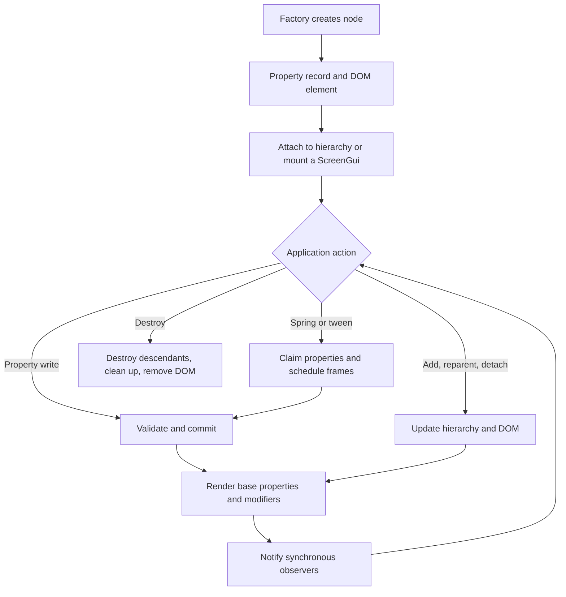

# FrameKit lifecycle and runtime behavior

This guide describes what a FrameKit node does from creation through destruction. It is written as a runtime map: the hierarchy, property store, DOM element, modifiers, events, and animations are separate pieces of one persistent object.

## The mental model

Every factory creates one long-lived node. The node has:

- a typed property record, which is the source of truth for application state;
- a hierarchy position (`Parent` and children);
- a DOM element when it is a GUI node;
- optional element-less modifiers, such as `UICorner` or `UIListLayout`;
- synchronous event listeners, value watches, cleanup callbacks, and animation ownership.

FrameKit does not recreate nodes or run a hidden render loop. A property or hierarchy operation immediately updates the affected DOM surface. Animation frames are the one exception: the shared animation scheduler asks active animations to produce the next property patch once per browser frame.

The high-level path looks like this:



## Creation and first render

1. A factory creates the node's DOM element when the node is GUI-backed. Modifiers do not create an element.
2. The factory combines its defaults with the caller's initial properties and validates the result.
3. The runtime creates a frozen public handle. Property accessors and methods forward to private runtime state; callers do not receive the mutable state record.
4. The factory applies initial DOM styles. A node can exist unattached: its element is real, but it is not in the document until its parent is attached or a `ScreenGui` is mounted.

Initial properties are validated before the node is returned. An invalid initial value or unknown property prevents creation.

## Changing properties

Both of these operations enter the same synchronous path:

```ts
panel.Rotation = 4;

panel.setProperties({
  Position: fk.udim2FromOffset(40, 80),
  Rotation: 4,
});
```

The property-change cycle is:

1. **Collect the patch.** A direct assignment is a one-property patch. `setProperties()` keeps all supplied properties in one transaction.
2. **Validate the patch.** Unknown properties, `null`, `undefined`, non-finite numbers, and invalid property-specific values are rejected. A node's custom validator then checks the complete proposed property record.
3. **Compute changed properties.** Values are compared with `Object.is`. A patch containing only equal values does not replace the property record or render the node.
4. **Commit and render.** The new record becomes authoritative, then the runtime renders the affected node. If the node has modifiers, the runtime restores base styles and recomposes modifier styles and layout output. A layout can also cause a parent or sibling child styles to be recalculated.
5. **Restore on render failure.** If rendering throws, the previous record is restored and FrameKit attempts to render the previous state again. If restoration also fails, the errors are reported together in an `AggregateError`.
6. **Notify observers.** Successful requested writes emit internal write events for every requested property, even when its value stayed equal. Public `onPropertyChanged()` listeners receive only properties whose value changed, with `(nextValue, previousValue)`.
7. **Report callback failures.** Listener errors do not roll back the committed state. FrameKit finishes the remaining callbacks, then throws one error or an `AggregateError` containing the callback failures.

### What “batching” means here

`setProperties()` is a synchronous property batch: it validates one patch, commits it as one state change, and starts one top-level render pass. It is not a deferred scheduler and it does not coalesce separate calls. If several changes belong together, put them in one `setProperties()` call rather than relying on a later frame.

Animation is frame-scheduled separately. A spring or tween may update several properties from one scheduler callback, but those updates still use the normal property transaction for each callback.

### Property edge cases

- Setting the current value again skips rendering and public change events, but the internal write event still fires. This is intentional: a direct write is an explicit claim of ownership and can interrupt an animation.
- An invalid patch changes neither the property record nor the DOM and emits no write or change events.
- A listener can perform another synchronous property write. That nested write starts immediately, so keep callbacks short and avoid accidental feedback loops.
- `onPropertyChanged()` is per property. Use `setProperties()` when several related changes should be committed and rendered together; listeners still run once for each changed property.
- Browser-driven synchronization also uses the same path. For example, native scrolling updates a scrolling frame's `CanvasPosition` after the browser changes it.

## Rendering and modifiers

The runtime keeps application properties as the base surface and treats modifier output as derived styles.

- A GUI node without modifiers can render only the properties listed as changed.
- Once modifiers are attached, FrameKit clears the old derived styles, renders the complete base surface, resolves style modifiers in tree order, and applies the combined result.
- `box-shadow` values are combined as comma-separated shadows. `filter` values are combined with spaces. Other conflicting style properties use the later modifier's value.
- A layout modifier computes parent styles and child placement from the parent's direct GUI children. Removing or changing a layout rerenders the affected parent and restores child base geometry where layout output no longer applies.
- A hidden base element keeps `display: none` when a modifier or layout would otherwise write a display value.

Modifiers are ordinary nodes in the hierarchy. They can be detached and reused, but a GUI parent accepts only one modifier of each class and modifiers cannot contain children.

## Animation and property ownership

Springs and tweens do not mutate private animation-only copies of the UI. They repeatedly write through the normal property path, so validation, rendering, and property observers remain consistent.

### Tweens

`createTween(node, options, goal)` validates the goal when the tween is created. Each `play()` call normally snapshots the node's current values as its starting point, claims the goal properties, and schedules work on the shared `requestAnimationFrame` scheduler.

- `Delay` produces the `Delayed` state before the first interpolation.
- `Duration: 0` with no delay completes synchronously when `play()` is called.
- `pause()` stops scheduling but keeps property ownership. `play()` resumes from the paused time.
- `cancel()` releases claims and emits the `Cancelled` state.
- Repeats and reversing operate on traversals of the same start and goal values.
- A new play on an already playing or delayed tween is a no-op.

### Springs

Each node retains one spring controller. Calling `fka.spring(node, goal)` again retargets the existing per-property springs from their current visual values and keeps their current velocities. Separate properties can settle independently, and the controller emits `completed` only when all active properties have settled.

### Ownership rules

Ownership is tracked per node and property, not per whole node.

- A spring and a tween can animate different properties at the same time.
- A new animation claiming an already-owned property cancels the previous owner for that property before taking the claim.
- A direct assignment or `setProperties()` write cancels the animation that owns that property, even if the assigned value is equal to the current value.
- An animation's own writes are marked internally so its write observer does not cancel itself.
- If claiming or applying a patch fails, the animation releases the claims it acquired and reports the failure.
- Destroying a node cancels active animation work, releases claims, and clears completion listeners.

The scheduler uses one browser-frame callback for all active animation tasks. Tasks started while that callback is running begin on the next frame. If several tasks fail in one frame, the scheduler reports their errors together.

## Hierarchy, detach, mount, unmount, and destroy

### Attach and reparent

`parent.addChild(child)` and `child.Parent = parent` use the same tree operation. The runtime validates active nodes, rejects cycles, rejects root-only nodes as children, and rejects modifiers as parents.

When reparenting succeeds, FrameKit updates the authoritative child list, moves the DOM element, and rerenders the old and new parents when layout or modifier output depends on the change. If that render fails, it restores the old parent, child index, DOM position, and affected rendering before throwing.

### Detach

`child.removeFromParent()` or `child.Parent = undefined` removes the node from its parent's child list and removes a GUI element from the DOM. It does not destroy the node, its descendants, its properties, its listeners, or its animations. The node can be attached again later.

Detaching a node that has no parent is a no-op. Detaching a modifier or a child from a layout parent rerenders the old parent so derived layout output disappears.

### ScreenGui mount and unmount

`ScreenGui` is a hierarchy root and cannot have a `Parent`. `mount(target)` appends its root element to a DOM element or selector; `unmount()` removes that element from the DOM and clears the mount record. Mounting is separate from FrameKit hierarchy ownership: it does not change `Parent` for the ScreenGui or its descendants.

`isMounted()` checks both the recorded target and the actual DOM parent. If external code moved or removed the element, the method returns `false` and clears stale bookkeeping. Mounting an already-mounted GUI to the same target is a no-op.

### Destroy

`destroy()` is permanent and recursive:

1. Children are detached from the logical tree and destroyed first, without causing intermediate parent rerenders for the subtree being removed.
2. The node is unlinked from its parent. Affected layout or modifier output is rerendered when needed.
3. The node is marked destroyed, then all registered cleanup callbacks run.
4. Event listeners, value watches, animation ownership, and mount bookkeeping are released through those cleanups.
5. A GUI element is removed from the DOM unless an ancestor removal already removed it.

Cleanup continues after individual callbacks fail. One failure is rethrown; multiple failures become an `AggregateError`. Operations that require a live node, including property reads and new animation work, throw after destruction. Destroying an already-destroyed node is otherwise harmless.

## Useful invariants and boundaries

- The FrameKit hierarchy is authoritative. DOM traversal does not tell you the logical parent, child order, or modifier ownership.
- `getChildren()` and `getDescendants()` return snapshots, so changing the returned array cannot mutate the tree.
- `Name` is editable application data; `ClassName` identifies the concrete FrameKit type.
- Event and value notifications are synchronous. A `watch()` callback runs once immediately, then on later value changes until it is unsubscribed or its owner is destroyed.
- Low-level `GuiElement.element` access is an escape hatch. Direct DOM edits do not update FrameKit state or hierarchy bookkeeping.
- Destroying a parent is the right operation when a subtree should disappear permanently. Detach or unmount when the objects should remain reusable.

## A practical debugging path

When behavior is surprising, inspect the system in this order:

1. Check `node.isDestroyed()` and `node.Parent`.
2. Print `node.toTreeString()` to verify the logical hierarchy and modifier placement.
3. Read the relevant properties and compare them with the element's computed or inline styles.
4. Temporarily subscribe with `onPropertyChanged()` to see which committed changes are observable.
5. For motion, inspect the controller state (`playbackState()` for tweens or `isAnimating()` for springs) and look for a direct write or competing animation claiming the same property.
6. For layout issues, check whether the layout modifier is attached to the expected parent and whether the node is a direct GUI child.
