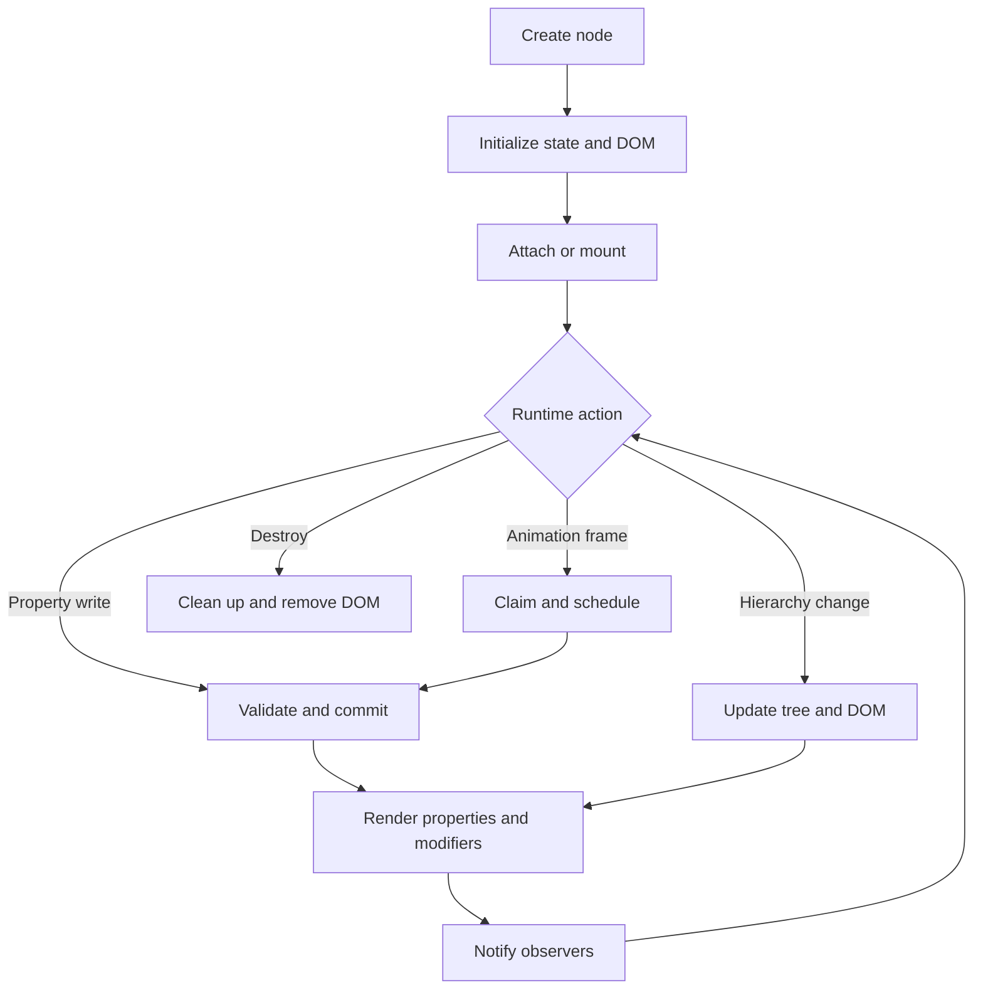

# FrameKit lifecycle and runtime behavior

This guide describes what a FrameKit node does from creation through destruction. It is written as a runtime map: the hierarchy, property store, DOM element, modifiers, events, and animations are separate pieces of one persistent object.

## The mental model

Every factory creates one long-lived node. It owns:

- a typed property record and hierarchy position (`Parent` and children);
- a DOM element when it is GUI-backed;
- optional element-less modifiers, listeners, value watches, cleanup callbacks, and animation ownership.

FrameKit does not recreate nodes or run a hidden render loop. A property or hierarchy operation immediately updates the affected DOM surface. Animation frames are the one exception: the shared animation scheduler asks active animations to produce the next property patch once per browser frame.

The high-level path looks like this:

## Creation and first render

A factory creates a GUI element when needed (modifiers have none), combines and validates defaults with initial properties, creates a frozen public handle over private state, and applies initial styles. A node may exist unattached: its element is real but remains outside the document until its parent is attached or a `ScreenGui` is mounted. Invalid initial properties prevent creation.

## Changing properties

Direct assignments and `setProperties({...})` enter the same synchronous path.

The property-change cycle is:

1. **Collect and validate.** A direct assignment is a one-property patch; `setProperties()` keeps all supplied properties in one transaction. Unknown, missing, non-finite, or property-invalid values are rejected, then the custom validator checks the complete proposed record.
2. **Compute changes.** Values use `Object.is`; an all-equal patch does not replace state or render.
3. **Commit and render.** The new record becomes authoritative. The runtime renders base properties, recomposes modifiers and layouts, and may recalculate affected parents or children.
4. **Restore failures.** If rendering throws, the old record is restored and rerendered. A failed restoration produces an `AggregateError`.
5. **Notify observers.** Internal write events cover every requested property, while `onPropertyChanged()` receives only changed properties with `(nextValue, previousValue)`. Callback errors do not roll back state; remaining callbacks still run and failures are aggregated.

### What “batching” means here

`setProperties()` is a synchronous batch: it validates one patch, commits one state change, and starts one top-level render pass. It is not deferred and does not coalesce separate calls, so group related changes in one call. Animation is frame-scheduled separately, but each callback still uses the normal property transaction.

### Property edge cases

- Equal-value writes skip rendering and public change events but still emit the internal write event, so they can interrupt animation ownership.
- Invalid patches emit nothing.
- Listener-triggered writes are immediate and nested, so avoid feedback loops.
- `onPropertyChanged()` is per property; listeners still run once per changed field in a batch.
- Browser synchronization, such as scrolling `CanvasPosition`, uses the same path.

## Rendering and modifiers

The runtime keeps application properties as the base surface and modifier output as derived styles.

- A GUI node without modifiers can render only changed properties. With modifiers, FrameKit clears old derived styles, renders the complete base surface, resolves style modifiers in tree order, and applies the result.
- `box-shadow` combines with commas, `filter` with spaces, and other conflicts use the later modifier.
- Layout modifiers compute parent styles and direct-child placement. Changing or removing one rerenders the parent and restores child base geometry where layout output no longer applies.
- A hidden base element keeps `display: none`.

Modifiers are ordinary nodes in the hierarchy. They can be detached and reused, but a GUI parent accepts only one modifier of each class and modifiers cannot contain children.

## Animation and property ownership

Springs and tweens do not mutate private animation-only copies of the UI. They repeatedly write through the normal property path, so validation, rendering, and property observers remain consistent.

### Tweens

`createTween(node, options, goal)` validates its goal at creation. `play()` snapshots current values, claims the goal properties, and schedules work.

- `Delay` enters `Delayed`; zero duration with no delay completes synchronously.
- `pause()` keeps ownership and resumes from the paused time; `cancel()` releases claims and emits `Cancelled`.
- Repeats and reversing reuse the same start and goal values. Replaying an already playing or delayed tween is a no-op.

### Springs

Each node retains one spring controller. Calling `fka.spring(node, goal)` again retargets per-property springs from current visual values while preserving velocity. Properties settle independently; `completed` emits when all active properties settle.

### Ownership rules

Ownership is tracked per node and property, not per whole node.

- Springs and tweens can animate different properties concurrently.
- A new claim cancels the previous owner for that property.
- Direct writes cancel the owner even for equal values; animation writes are marked so they do not cancel themselves.
- Failed claims or patches release acquired claims.
- Destroying a node cancels animation, releases claims, and clears completion listeners.

The scheduler uses one browser-frame callback for all active animation tasks. Tasks started while that callback is running begin on the next frame. If several tasks fail in one frame, the scheduler reports their errors together.

## Hierarchy, detach, mount, unmount, and destroy

### Attach and reparent

`parent.addChild(child)` and `child.Parent = parent` share one operation. It validates active nodes, rejects cycles, root-only children, and modifier parents, then updates the child list, DOM position, and affected rendering. A render failure restores the old parent, child index, DOM position, and rendering.

### Detach

`child.removeFromParent()` or `child.Parent = undefined` removes hierarchy and GUI DOM attachment without destroying the node, descendants, properties, listeners, or animations. The node can be reused. Detaching an unparented node is a no-op; detaching from a layout parent rerenders that parent.

### ScreenGui mount and unmount

`ScreenGui` is a hierarchy root and cannot have a `Parent`. `mount(target)` appends its root element; `unmount()` removes it and clears the mount record without changing hierarchy ownership. `isMounted()` checks the record and actual DOM parent, clearing stale bookkeeping after external DOM moves. Mounting to the same target is a no-op.

### Destroy

`destroy()` is permanent and recursive:

1. Children are detached and destroyed first without intermediate subtree rerenders.
2. The node is unlinked and affected layout or modifier output is rerendered.
3. It is marked destroyed, cleanups release listeners, watches, animations, and mount bookkeeping, and its GUI element is removed unless an ancestor already removed it.

Cleanup continues after individual callbacks fail. One failure is rethrown; multiple failures become an `AggregateError`. Operations that require a live node, including property reads and new animation work, throw after destruction. Destroying an already-destroyed node is otherwise harmless.

## Useful invariants and boundaries

The FrameKit hierarchy is authoritative; DOM traversal does not reveal logical ownership. `getChildren()` and `getDescendants()` return snapshots. `Name` is editable data, while `ClassName` identifies the concrete type. Events and value watches are synchronous, and `watch()` runs immediately before later changes until stopped or destroyed.

`GuiElement.element` is an escape hatch: direct DOM edits do not update FrameKit state. Destroy permanently removes a subtree; detach or unmount when objects should remain reusable.

## A practical debugging path

When behavior is surprising:

1. Check `isDestroyed()` and `Parent`, then print `toTreeString()`.
2. Compare properties with DOM styles and temporarily subscribe with `onPropertyChanged()`.
3. For motion, inspect tween `playbackState()` or spring `isAnimating()` and look for a direct write or competing owner.
4. For layout, verify the modifier is attached to the expected parent and the node is a direct GUI child.
